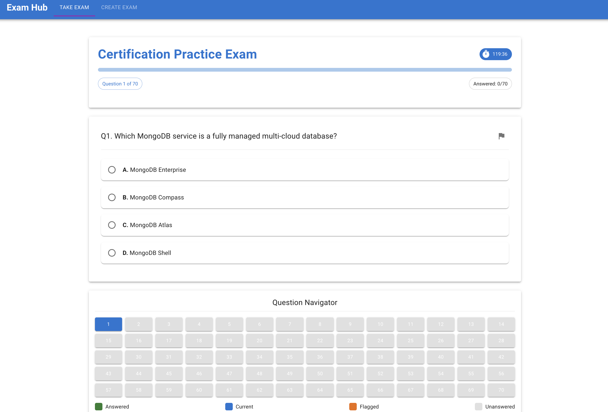
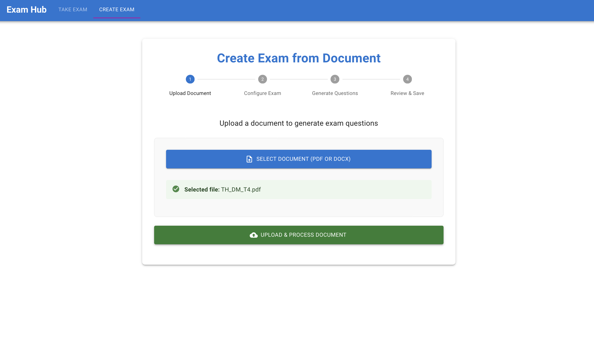
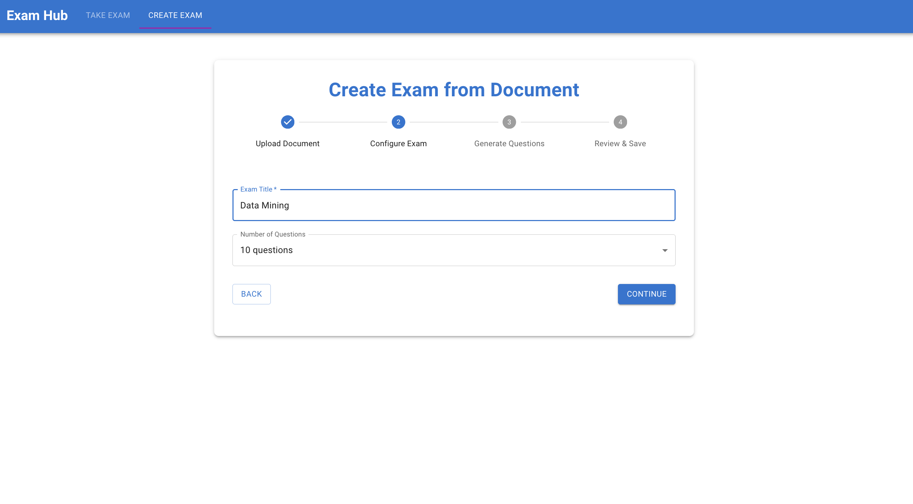
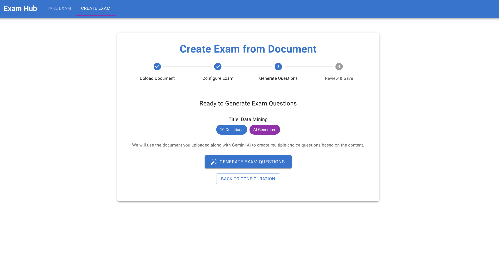

# Exam Hub - AI-Powered Exam Generator

An intelligent exam generation application that creates multiple-choice questions from documents using Google Gemini AI.

## Screenshots

### Main Interface


### AI Generation Process




## 🚀 Live Demo

**Live Demo:** https://exam-app-gules.vercel.app/

## Features

- Upload PDF and DOCX documents
- Automatic question generation using Google Gemini AI
- Multiple-choice questions with explanations
- Timed exam system with instant scoring
- Modern responsive web interface

## Tech Stack

- **Frontend:** React.js + Material-UI
- **Backend:** FastAPI + LangChain + Google Gemini AI
- **Deployment:** Vercel (frontend) + Railway (backend)

## Quick Start

### Prerequisites
- Python 3.11+
- Node.js 18+
- Google Gemini API key

### Installation

```bash
# 1. Clone repository
git clone https://github.com/yourusername/Exam-hub.git
cd Exam-hub

# 2. Backend setup
cd backend
python -m venv venv
source venv/bin/activate
pip install -r requirements.txt
echo "GEMINI_API_KEY=your_api_key_here" > .env

# 3. Frontend setup  
cd ../exam-app
npm install

# 4. Start development
cd ..
./start-dev.sh
```

### Development URLs
- Frontend: http://localhost:3000
- Backend: http://localhost:5001
- API Docs: http://localhost:5001/docs

## API Endpoints

```
POST /api/upload         # Upload document
POST /api/generate-exam  # Generate questions
POST /api/save-exam      # Save exam to system
GET  /health             # Health check
GET  /docs               # API documentation
```

## Usage

1. Upload a PDF or DOCX document
2. Configure exam title and question count
3. AI generates multiple-choice questions
4. Review questions and save to system
5. Take exam with timer and get instant results

## Project Structure

```
backend/
├── app.py              # Main FastAPI app
├── api/                # Modular endpoints
├── core/               # Configuration & logging
├── models/             # Pydantic models
├── llm_generator.py    # AI question generation
└── document_processor.py

exam-app/
├── src/components/     # React components
├── src/contexts/       # State management
└── src/data/           # Question storage
```

## Environment Variables

**Backend (.env):**
```
GEMINI_API_KEY=your_api_key_here
```

**Frontend:**
- Development: localhost:5001 (automatic)
- Production: Railway URL (default)

## License

MIT License
